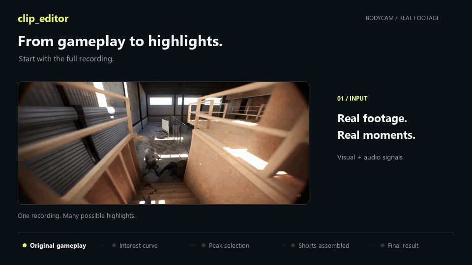

# clip_editor

**An end-to-end Machine Learning pipeline for automatic gameplay highlight detection and short-form video generation.**



Experimental historical dataset results: **cross-validated ROC-AUC 0.804 · Average Precision 0.380 · Precision 0.443 · Recall 0.383 · F1 0.411 · 70 features · 14,363 training rows**.
These are the recorded results in [scorer_meta.json](studio/model/scorer_meta.json), not a new benchmark. ROC-AUC/AP are pooled out-of-fold metrics, not fold means. The old grouping has known leakage risks; precision/recall/F1 used the same predictions for threshold selection and measurement. See the [model card](MODEL_CARD.md) before interpreting them.

> Independent experimental project built around BODYCAM gameplay. This project is not affiliated with, sponsored by, or endorsed by Reissad Studio.

[Installation](#requirements) · [Model card](MODEL_CARD.md) · [Contributing](CONTRIBUTING.md)

## What it does

Gameplay recordings become visual and audio signals sampled at 3 FPS. Pretrained YOLO supplies person detections; BODYCAM HUD heuristics estimate enemy-related signals. Motion, brightness, contrast, saturation, red/flash signals, edge density, hitmarker signal, friendly HUD signal and audio bands feed temporal windows and spikes. A `HistGradientBoostingClassifier` produces an interest score.

Peak detection and automatic grouping propose highlights. The local Studio lets an editor inspect and adjust them, synchronize cuts to a BPM/beat grid, and assemble Shorts. The harness renders through FFmpeg and validates format, duration, audio and loudness. Editorial review remains necessary: a score is not proof of a kill.

Optional YouTube Analytics collects real performance feedback for **future** ranking models. It does not currently close an automatic retraining loop or publish videos.

```mermaid
flowchart LR
    A[Gameplay] --> B[Feature Extraction]
    B --> C[Visual + Audio + YOLO Signals]
    C --> D[Temporal Features]
    D --> E[HistGradientBoosting]
    E --> F[Interest Score]
    F --> G[Peak Detection]
    G --> H[Highlight Grouping]
    H --> I[Beat-aware Editing]
    I --> J[FFmpeg Rendering + Validation]
    J -. Optional collection after manual publication .-> K[YouTube Feedback]
    K -. Future work .-> L[Ranking Models]
```



## Requirements

- **Windows, Python 3.13**: current locally tested environment. Code uses Python 3.11+ APIs, but other Python versions and Linux/macOS are not validated here. Rendering artwork uses Windows fonts.
- **FFmpeg and FFprobe**: put `ffmpeg.exe` and `ffprobe.exe` in `_tools/`, or install them on `PATH`. Local binaries take precedence. Obtain a build with H.264/libx264 and AAC support from the [FFmpeg download page](https://ffmpeg.org/download.html).
- Install the Python requirements below, including PyTorch, OpenCV and Ultralytics. No preinstalled ML stack is assumed. GPU-specific PyTorch wheels may require the [official installer](https://pytorch.org/get-started/locally/).
- NVIDIA GPU optional. The harness defaults to NVENC; CPU rendering uses `--encoder libx264`. CPU feature extraction is possible. The Studio currently invokes the harness default renderer.
- Supply your own recordings, labelled training data and permitted music. Private datasets, music, trained scorer and YOLO weights are not distributed.

```powershell
python -m venv .venv
.venv\Scripts\Activate.ps1
python -m pip install --upgrade pip
python -m pip install -r studio/requirements.txt
python -m pytest studio/tests -q
python studio/app.py
```

Open http://127.0.0.1:8765. Keep the server local. Put source recordings in `gravacoes/` and music in `audio/`. The existing editorial preset references `audio/beat_phonk.wav`; that file is not supplied. Configure and verify the BPM/grid for your own permitted track.

For the full feature pipeline, obtain the pretrained `yolov8n.pt` weights from [Ultralytics](https://docs.ultralytics.com/models/yolov8/) and place them in `studio/model/`. Ultralytics may download weights when invoked. Missing YOLO can degrade extraction to signals without the detector; inspect extraction messages rather than comparing that run to the recorded benchmark.

A fresh clone **has no trained scorer**. Prepare raw recordings with approved cuts (`projeto/edicao.json`), positive raw clips in `clipes_kill/`, and/or labelled stills in `frames/kill/` and `frames/nada/`. Read [dataset provenance](docs/DATASET.md), then run:

```powershell
python studio/pipeline/train.py
```

Training writes local model artifacts and `scorer_meta.json`; back up an existing model before retraining. Historical metrics cannot be independently reproduced without the private dataset. The [example plan](examples/example_plan.json) illustrates the schema and must be adapted to your own media; it is not a bundled demo dataset.

## Editing and rendering

The official workflow is **Studio + harness**: analyze, inspect the curve, group highlights, review cuts, generate a plan, render, validate, visually review. VieirasPlay is the existing presentation preset. Standard reviewed batches contain five 1080×1920, 60 FPS Shorts, normally 20–22 seconds; inspect each generated plan because older defaults may differ.

For CPU rendering of a prepared plan:

```powershell
python harness/shorts.py check harness/plano_my_batch.json
python harness/shorts.py render harness/plano_my_batch.json --encoder libx264
python harness/shorts.py verify harness/plano_my_batch.json
```

See [Studio operation](studio/README.md), [harness operation](harness/README.md) and [optional YouTube feedback](studio/youtube/README.md). Production plans/history stay on disk, ignored by Git. Preserve them to prevent reusing old cuts.

## Visual demo

The GIF above follows real local footage through the saved model interest curve,
three selected moments, a beat-aligned timeline, and an excerpt of the rendered
vertical Short. Its presentation is conceptual; the footage and scores are real.
English captions are applied to the GIF preview, without modifying the original
recordings or exports. See [demo details](docs/assets/README.md).

Studio UI screenshots are still a separate documentation task; see the
[capture guide](docs/README.md).

## Repository

`studio/` contains the local UI, ML pipeline and optional feedback collector. `harness/` handles planning, rendering and validation. `examples/` contains a generic plan. `legacy/` preserves earlier scripts. No media or trained weights are required for the automated tests; FFmpeg generates tiny test fixtures.

## License and release status

This project is licensed under the **GNU Affero General Public License v3.0 only** (`AGPL-3.0-only`). See the full [LICENSE](LICENSE) and [dependency review](docs/DEPENDENCIES.md). Third-party dependencies retain their own licenses; BODYCAM assets, music, fonts, artwork and third-party weights are not relicensed by this project.

The preparation does not publish the repository or post to any social platform. See the [review report](docs/RELEASE_REVIEW.md) for checks and remaining limitations.
